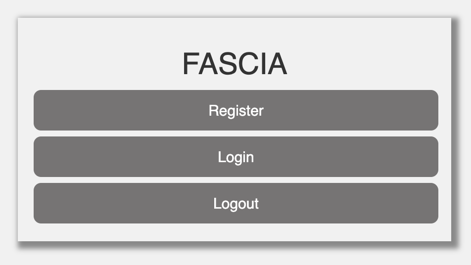
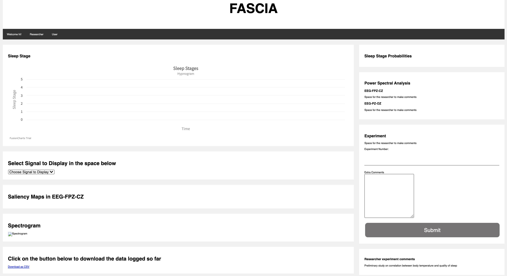
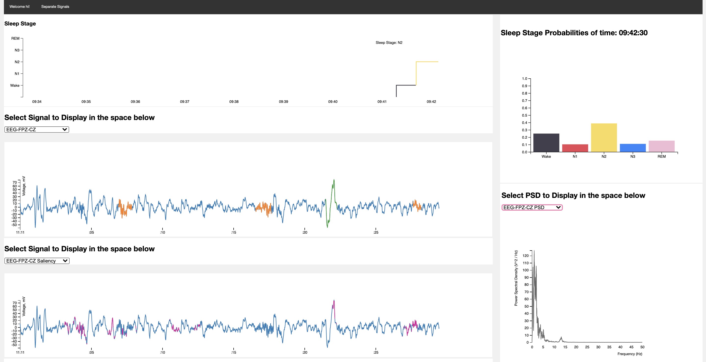
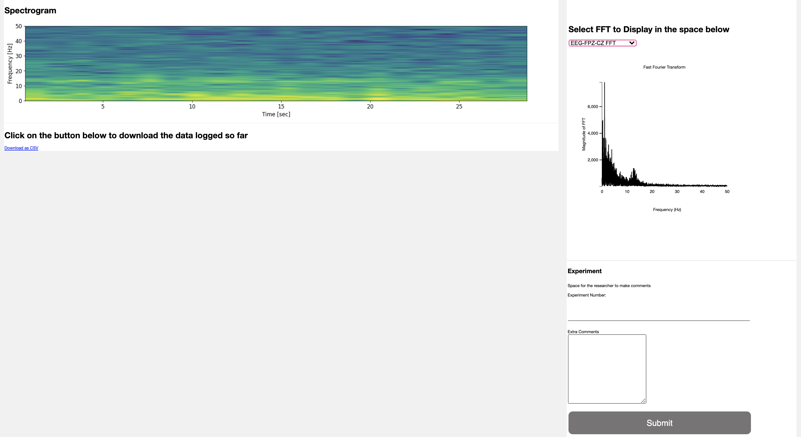

# FASCIA- A brief Overview

## Interface Details

### Registration Page



### Complete Interface



### Interface






## Website Details - Usage

This is a brief overview of the code behind the FASCIA Website: [http://fascia.media.mit.edu:8080/](http://fascia.media.mit.edu:8080/)

In order to run the website, please follow the following steps:

1. Open 2 terminals, type 

```jsx
ssh gamma@fascia.media.mit.edu 
```

(and enter the password) in both terminals

1. Enter `backend` into the first terminal
2. Once the terminal says 'Server Started', Enter `frontend` into the second terminal
3. Open [http://fascia.media.mit.edu:8080/](http://fascia.media.mit.edu:8080/)
4. You're now on the homepage! 

    ### New Users

    If it is your first time using the website, you need to register with a username and password. Click on the 'Register' tab at the homepage and register. If the registration is not successful, it's possible that the username has already been taken. Please try again. Once successful, you should be taken to the main interface.

    ### Existing Users

    If you have already registered, click on the 'Login' tab at the homepage, and login with your credentials. If the login is not successful, it's possible that either the username or password has been entered incorrectly. Please try again. Once successful, you should be taken to the main interface.

5. You're now on main page! Wait for 30 seconds on the main page for the signals to start appearing.

    The top left of the page displays the sleep stage detected from the last 30 seconds of data. Below that is a dropdown that allows you to choose which signal to display. Orange - Spindles, Green - Slow Waves. Below this is an option to download all the data logged so far. 

    On the right is the Power Spectral Density for EEG-FPZ-CZ and EEG-PZ-OZ channels. Below this is an option to enter experiment number along with any other comments. 

## Website Details - Development

Here is the file structure: (Click on the arrows on the side to open more details)

- backend
    - SleepEDF_NPZ
        - SC4001E0.npz [Signal from a participant's entire night sleep]
    - data
        - epoch_custom.npz [Single 30-second file to predict sleep stages from]
    - models
        - cnn_crf_model.ckpt [Model checkpoint to load weights from]
    - [model.py](http://model.py)  [Model construction details]
    - [predict.py](http://predict.py) [Prediction of a sleep stage from 30-sec epoch]
    - [trigger.py](http://trigger.py) [Script to run [predict.py](http://predict.py) every 30 seconds]
    - [utils.py](http://utils.py) [Additional utility functions (such as `rescale_array`) here]
- frontend
    - data
        - All the signal data from `epoch_custom.npz` to be displayed in a json format
    - models
        - user.js [Mongoose model to store login data]
    - server.js [Main server script that takes care of login, displaying to the client HTML, and store the data in a MongoDB database]
    - views
        - css
            - stylesheet.css [File that contains all the style-related data]
        - home.ejs [HTML to be rendered when user goes to the homepage]
        - index.ejs [Main HTML interface to be rendered when user is logged in]
        - login.ejs [HTML to be rendered when user goes to the login page]
        - psd.js [Script to render the PSD plots]
        - register.ejs [HTML to be rendered when user goes to the register page]
        - signals.js [Script to render the various signal plots for the channels]
        - sleepstagefc.js [Script to render the Sleep Stage plot]

## Important Code

### Trigger.py

- Saves consecutive 30-second epochs from 'SleepEDF_NPZ/SC4001E0.npz' to 'data/epoch_custom.npz'

```python
np.savez(save_path, **save_dict)
```

- Contains a `RepeatedTimer` class to handle calling a function (`func` in predict.py) once in an interval (30 seconds). `func` determines the sleep stage from data/epoch_custom.npz and inserts it in a queue. [Trigger.py](http://trigger.py) reads the sleep stage from the queue. This is done because the `RepeatedTimer` object creates a new thread for every run, and python sockets aren't able to handle multiple threads.

```python
rt = RepeatedTimer(30, func, qu)
. . .
sleepstage = qu.get()
```

- Saves all the data to be rendered in the main interface in different .json files.
    - EEG-FPZ-CZ and EEG-PZ-OZ: with channel values, spindles, and slow waves detected
    - Saliency maps for all channels
    - EOG, Resp-Oro-Nasal, EMG, Temp with channel values
    - Probabilities of the sleep stages predicted
    - PSD for EEG-FPZ-CZ and EEG-PZ-OZ channels.

```python
with open('../frontend/data/'+channels[index]+'.json', 'w') as f:
    f.write(str(all_rows).replace('\'', '"').replace('None', 'null'))
```

- Sends the Sleep Stage to the Node.js server

```python
nodeserv(hyp[int(sleepstage)], cn)
```

### server.js

- Handles Registration, Login, and Logout with authentication using passport-local-mongoose

    (User is defined in models/user.js):

    ```jsx
    //IN USER.JS
    var UserSchema = new Schema({
        username : {type: String, unique: true, required:true},
    });

    // plugin for passport-local-mongoose
    UserSchema.plugin(passportLocalMongoose);

    // export userschema
     module.exports = mongoose.model("User", UserSchema);
    ```

    Example of rendering the main interface in server.js: [`isLoggedIn` is handled by passport username and password authentication]

    ```jsx
    // Showing main interface
    app.get("/index", isLoggedIn, function (req, res) {
        res.render("index", { username: req.user.username });
    });
    ```

- Handles the displays to the interface:
    - Handles the sleep stage sent from the python script:

```jsx
//data contains the sleep stage
client.on('data', (data) =>
{
	strData = parseInt(data.toString());
	. . . 
```

- Reads all the data to be rendered stored in jsons

```jsx
let raweeg_fpzcz = fs.readFileSync('data/EEG-FPZ-CZ.json');
let eeg_fpzcz = JSON.parse(raweeg_fpzcz);
. . .
```

- Sends all this data to the HTTP client to render via an event called `SleepStage`

```jsx
socket.emit('SleepStage',
    {
				sleepprob: sleepprob,
        eeg_fpzcz: eeg_fpzcz,
        eeg_pzoz: eeg_pzoz,
        eeg_fpzcz_grad: eeg_fpzcz_grad,
        eog:eog,
        resp:resp,
        emg:emg,
        psd_fpzcz:psd_fpzcz,
        psd_pzoz: psd_pzoz,
        temp:temp
    });
```

- Inserts all the data to be stored in the MongoDB database (Database: `FASCIA`, Collection: `UserData`)

```jsx
MongoClient.connect(url, function(err, db) {
  if (err) throw err;
  var dbo = db.db("FASCIA");
	. . . 
	let coll = dbo.collection('UserData');
	var insert = {_id: count, EEG_FPZ_CZ:eeg_fpzcz, EEG_PZ_OZ:eeg_pzoz, EOG:eog, Resp_Oro_Nasal:resp, EMG:emg, Temp:temp};
	
	coll.insert(insert, function (err, res) {
	. . . 
	}
```

- Up to now, the code only handles rendering data once every 30 seconds. However, if the user clicks on the dropdown, data needs to be re-rendered since the <div>'s may have been hidden when the data was sent to the client. This is handled by the event `Updated`.  Event emitted in the index.ejs file is shown in bold below.

```jsx
//IN INDEX.EJS
//Code to handle dropdown menu
$(document).ready(function(){
    $("select").change(function(){
        $(this).find("option:selected").each(function(){
            var optionValue = $(this).attr("value");
            if(optionValue){
                $(".graphbox").not("." + optionValue).hide();
                $("." + optionValue).show();
                **socket.emit("Updated", "data");**
            } else{
                $(".graphbox").hide();
            }
        });
    }).change();
});
```

In server.js, all the data is re-sent to the client on this event.

```jsx
socket.on('Updated', (data) =>
{
	. . . 
	let raweeg_fpzcz = fs.readFileSync('data/EEG-FPZ-CZ.json');
	. . . 
	socket.emit('SleepStage',
    {
			. . . 
		}
}
```

- To handle downloads, an event is emitted from index.ejs when a user clicks on the download link: (On click, the `getCSV` function is triggered, which in turn emits the event `Download`

```jsx
//IN INDEX.EJS
<a id="download_link" onclick="getCSV()" download="Exported_data.csv" href=””> Download as CSV </a>

function getCSV(){
    socket.emit("Download", "download");
	. . . 
	}
```

In server.js, this event is handled, and the entire data from the database is sent to the client

```jsx
socket.on('Download', (data) => {
    MongoClient.connect(url, function(err, db) {
		. . . 
		var dbo = db.db("FASCIA");
    dbo.collection("UserData").find({}).toArray(function (err, result) {
		. . . 
		//The database data is sent in the variable result
		socket.emit('DownloadResponse', {result});
		. . . 
		});
});
```

Now index.ejs handles the event `DownloadResponse` and creates a CSV from the data

```jsx
socket.on('DownloadResponse', function (data) {
	. . . 
	//Restructing the JSON
	//Creating CSV from the restructured JSON - 
	//stored in variable csv

	var contentType = 'text/csv';
  var data_download = new Blob([csv], {type: contentType});
  var url = window.URL.createObjectURL(data_download);
  document.getElementById('download_link').href = url;
	
});
```

### index.ejs

Some of the code in index.ejs has already been explained in the server.js code explanation

- Handles the layout of the page - display of the sleep stages, all 6 channels,  Download links, PSD graphs, Researcher comments etc. Check the file structure to know the use of all files.

```html
<div class="card">
  <h2>Sleep Stage</h2>
  <div id="sleep-stage"></div>
</div>

<div class = "card">
. . . 
```

- Updates the graphs every 30 seconds on receiving data from the server.

```jsx
socket.on('SleepStage', function (fulldata) {
		redraw_sleepprob(fulldata.sleepprob);
    redraw_eeg(fulldata.eeg_fpzcz, 'eeg-fpzcz', clientWidth, clientHeight);
    redraw_eeg(fulldata.eeg_pzoz, 'eeg-pzoz', clientWidth, clientHeight);
		. . . 
		});
```
